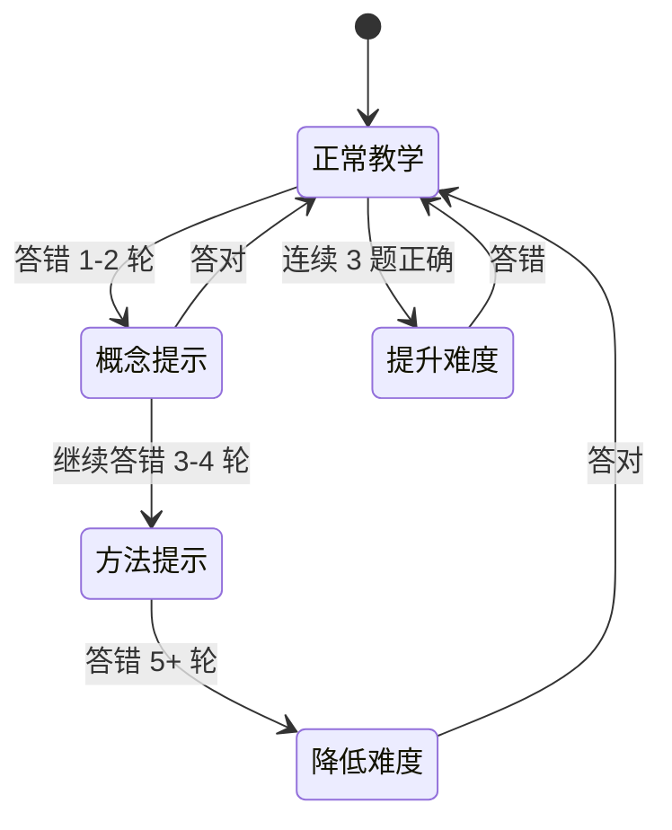
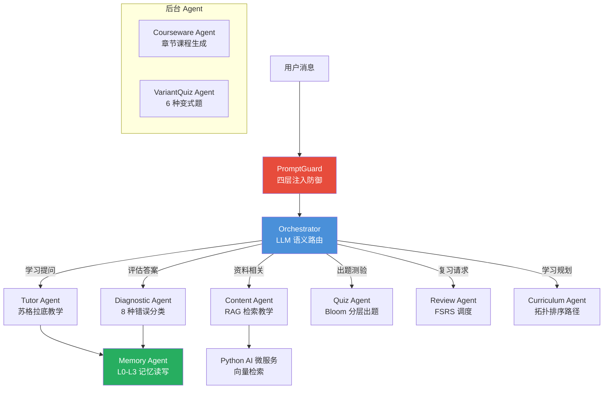
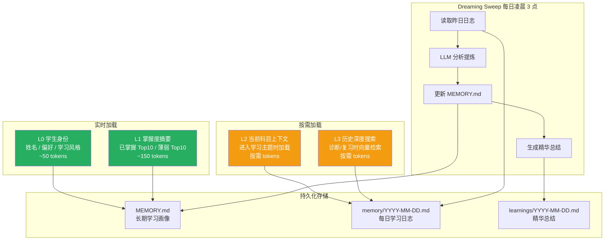
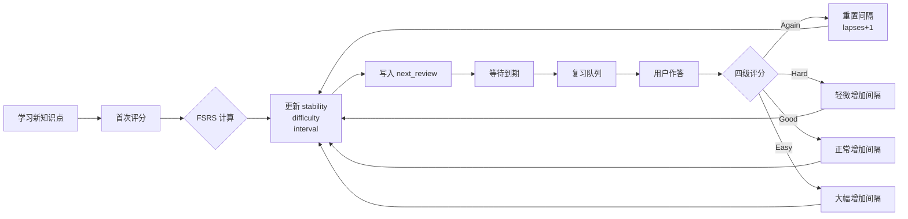
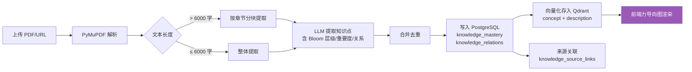
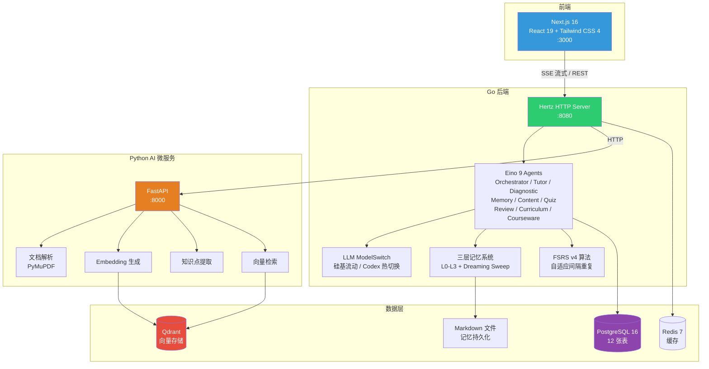
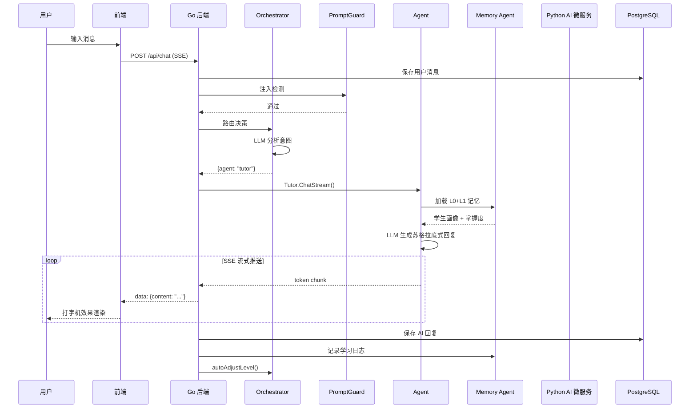
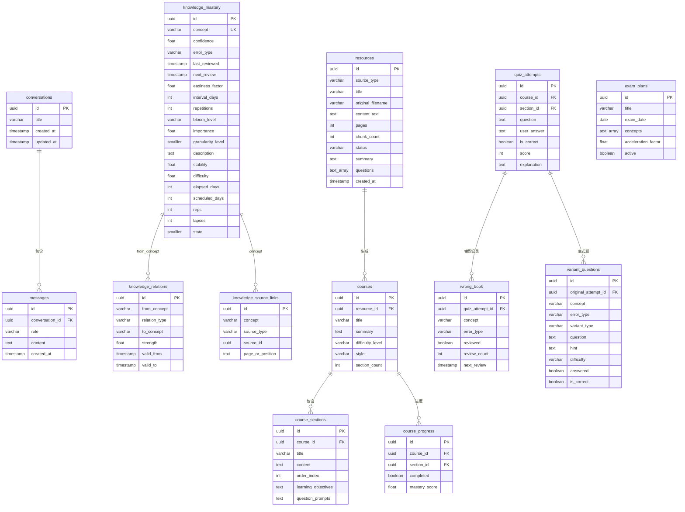

<p align="center">
  <h1 align="center">MindFlow</h1>
  <p align="center">
    <strong>AI 原生的苏格拉底式自适应学习平台</strong>
  </p>
  <p align="center">
    不给答案，只给引导。有记忆，会主动驱动你的学习节奏。
  </p>
  <p align="center">
    🌐 Web + 📱 Android / iOS 全平台支持
  </p>
</p>

<p align="center">
  <a href="#快速开始">快速开始</a> ·
  <a href="#核心功能">核心功能</a> ·
  <a href="#系统架构">系统架构</a> ·
  <a href="#移动端">移动端</a> ·
  <a href="#部署文档">部署文档</a> ·
  <a href="#开发文档">开发文档</a> ·
  <a href="#api-接口文档">API 文档</a>
</p>

---

## 这是什么

MindFlow 是一个 **AI 私人导师**——上传学习资料，AI 自动解析内容、构建知识图谱、通过苏格拉底式对话教学、诊断薄弱点、基于遗忘曲线安排复习。它不是问答机器人，而是一个有记忆、会主动规划学习节奏的完整学习系统。

### 与传统学习工具的对比

| 维度 | 传统 AI 学习工具 | MindFlow |
|------|-----------------|----------|
| 教学方式 | 直接给答案 | 苏格拉底式引导，从不直接告知 |
| 记忆能力 | 每次对话从头开始 | L0-L3 四层记忆，跨会话持续记忆学习状态 |
| 学习节奏 | 被动等提问 | AI 主动安排复习、推荐下一步、生成晨间简报 |
| 错误处理 | "答案是 X" | 8 种错误分类 + 根源追踪 + 6 种变式题训练 |
| 复习系统 | 无 | FSRS 自适应间隔重复 + 易混淆交错复习 |
| 知识管理 | 无 | 自动构建知识图谱 + 力导向可视化 + 语义搜索 |

### 界面预览

```
┌─────────────────────────────────────────────────────────────┐
│  MindFlow                              [设置] [晨间简报 💡]  │
├──────────┬──────────────────────────────────────────────────┤
│ 会话列表  │  苏格拉底对话区                                    │
│          │                                                  │
│ > 线性代数│  AI: 你提到特征值分解，能告诉我特征值的                │
│   微积分  │      几何意义是什么吗？                              │
│   物理力学│                                                   │
│          │  你: 特征值表示变换在特征向量方向上的缩放比例            │
│          │                                                   │
│          │  AI: 很好！那如果特征值是负数，几何上会                 │
│          │      发生什么变化？                                  │
│          │                                                   │
│──────────│  [输入框...]                          [发送]       │
│ 📚 资料   │──────────────────────────────────────────────────│
│ 🧠 知识   │  掌握度: 72% ██████████░░░░  |  复习: 3 个到期     │
│ 📊 仪表盘 │──────────────────────────────────────────────────│
│ 📝 测验   │                                                  │
│ 🔄 复习   │                                                  │
└──────────┴──────────────────────────────────────────────────┘
```

---

## 目录

- [核心功能](#核心功能)
  - [苏格拉底式对话](#1-苏格拉底式对话)
  - [多 Agent 系统](#2-多-agent-系统)
  - [三层记忆系统](#3-三层记忆系统)
  - [FSRS 自适应复习](#4-fsrs-自适应复习)
  - [三模式测验](#5-三模式测验)
  - [知识图谱](#6-知识图谱)
  - [错题本与变式题](#7-错题本与变式题)
  - [AI 晨间简报](#8-ai-晨间简报)
  - [考试模式](#9-考试模式)
  - [资料理解](#10-资料理解)
  - [学习仪表盘](#11-学习仪表盘)
- [系统架构](#系统架构)
- [技术栈](#技术栈)
- [移动端](#移动端)
- [快速开始](#快速开始)
- [部署文档](#部署文档)
- [开发文档](#开发文档)
- [数据库设计](#数据库设计)
- [API 接口文档](#api-接口文档)
- [更新历史](#更新历史)

---

## 核心功能

### 1. 苏格拉底式对话

MindFlow 的核心教学方式。AI **绝不直接给答案**，通过三大教学框架引导学生自己推导。

#### 三大教学框架

| 框架 | 触发场景 | 流程 |
|------|---------|------|
| **IARA**（推理引导） | 学生提问时 | Identify 确认理解 → Ask 引导提问 → Reflect 反思推理 → Advance 推进 |
| **CARA**（纠错引导） | 学生答错时 | Catch 识别错误 → Ask counter 提出反例 → Redirect 引导方向 → Affirm 肯定纠正 |
| **SER**（脚手架策略） | 动态调整 | 根据连续错误/正确次数自动调整支持力度 |

#### SER 脚手架动态调整



#### 三种教学风格 × 自动难度适应

- **苏格拉底式**（默认）：引导提问，从不直接告知
- **深入原理**：从底层原理讲起，适合理工科
- **通俗比喻**：用生活比喻解释抽象概念

难度自动适应：错误率 > 60% → 初学模式 | 错误率 < 20% 且连续 3 正确 → 专家模式。

> **关键代码路径**：`backend/internal/agent/tutor.go`（IARA/CARA/SER Prompt）、`backend/internal/agent/orchestrator.go`（StuckDetector + autoAdjustLevel）

---

### 2. 多 Agent 系统

基于 **Eino** 框架编排 9 个专职 Agent，Orchestrator 通过 LLM 语义路由（严禁关键词匹配）分发到最合适的 Agent。



| Agent | 职责 | 触发条件 |
|-------|------|---------|
| **Orchestrator** | LLM 分析用户意图，路由到对应 Agent | 每条用户消息 |
| **Tutor** | 苏格拉底式教学（IARA/CARA/SER） | 学习提问（默认） |
| **Diagnostic** | 分析回答，8 种错误分类（5 基础 + 3 元认知） | 学生给出明确答案时 |
| **Memory** | L0-L3 分层记忆读写，维护学生画像 | Tutor/Diagnostic 调用 |
| **Content** | 基于上传资料的 RAG 检索教学，标注来源 | 提到资料/文档/上传内容时 |
| **Quiz** | Bloom 认知分层出题 + 对话考察 + Anki | 要求测试/检验掌握度 |
| **Review** | FSRS 复习调度 + 易混淆概念交错 | "开始复习""复习一下" |
| **Curriculum** | AI 晨间简报 + 拓扑排序学习路径 | "接下来学什么"/学习建议 |
| **Courseware** | 资料转结构化章节课程 | 生成课程触发 |
| **VariantQuiz** | 根据错误类型生成 6 种变式题 | 错题练习触发 |

> **关键代码路径**：`backend/internal/agent/orchestrator.go`（路由决策）、`backend/internal/agent/guard.go`（注入防护）

---

### 3. 三层记忆系统

借鉴 MemPalace 设计，MindFlow 拥有跨会话的持久记忆能力。每层有明确的 Token 预算和加载策略。



记忆文件基于 Markdown，人类可读、Git 友好。采用原子写入（write-temp + rename）和 `sync.RWMutex` 并发锁防止竞态。

> **关键代码路径**：`backend/internal/memory/store.go`（Store 读写）、`backend/internal/memory/dreaming.go`（Dreaming Sweep）、`backend/internal/agent/memory_agent.go`（Memory Agent）

---

### 4. FSRS 自适应复习

使用 **FSRS v4 算法**替代 SM-2，基于可优化权重，根据个人历史数据自适应调整复习间隔。



#### 四级评分

| 按钮 | 含义 | 影响 |
|------|------|------|
| **Again** | 完全忘记 | 重置间隔，大幅降低稳定性，lapses+1 |
| **Hard** | 勉强想起 | 轻微增加间隔 |
| **Good** | 正常回忆 | 正常增加间隔 |
| **Easy** | 非常简单 | 大幅增加间隔 |

#### 易混淆交错复习

复习队列自动查询知识图谱中的 `similar` 关系，将易混淆概念交错排列（如"速度"与"加速度"相邻出现），强化区分记忆。

#### 拓扑排序学习路径

基于知识图谱 `prerequisite` 关系，使用 Kahn 拓扑排序算法生成学习路径，确保先学前置知识再学进阶内容。

> **关键代码路径**：`backend/internal/review/sm2.go`（FSRS 算法）、`backend/internal/agent/review.go`（Review Agent）、`backend/internal/handler/review.go`（复习 Handler）

---

### 5. 三模式测验

测验页提供三种模式，适配不同学习场景。

```mermaid
graph TB
    subgraph 题目测验
        Q1[选择知识点] --> Q2[Bloom 层级匹配]
        Q2 --> Q3[AI 生成题目]
        Q3 --> Q4[用户作答]
        Q4 --> Q5[AI 评分 + 解析]
        Q5 --> Q6[更新 FSRS 掌握度]
        Q5 -->|答错| Q7[写入错题本]
        Q7 --> Q8[生成变式题]
    end

    subgraph Anki 卡片
        A1[展示题目正面] --> A2[点击翻转]
        A2 --> A3[查看参考答案]
        A3 --> A4[四按钮自评<br/>Again/Hard/Good/Easy]
        A4 --> A5[直接更新 FSRS]
    end

    subgraph 对话考察
        C1[AI 开放性提问] --> C2[多轮追问]
        C2 --> C3[提出反例]
        C3 --> C4[请学生总结]
        C4 --> C5[AI 自主判断结束]
        C5 --> C6[输出综合评分]
    end
```



#### Bloom 认知分类法出题

| 掌握度 | 出题层级 | 题目类型 |
|--------|---------|---------|
| < 30% | 记忆 | 定义、识别 |
| 30-50% | 理解 | 解释、比较 |
| 50-70% | 应用 | 实际问题求解 |
| 70-85% | 分析 | 推理、归因 |
| 85-95% | 评价 | 判断、评估 |
| > 95% | 创造 | 设计、综合 |

> **关键代码路径**：`backend/internal/agent/quiz.go`（出题 + 评分）、`backend/internal/handler/quiz.go`（三模式 Handler）

---

### 6. 知识图谱

上传资料后 AI 自动提取知识点并构建关系图谱，前端力导向图实时渲染。



#### 知识点属性

每个知识点包含：Bloom 认知层级（remember → create）、重要度（0-1）、粒度等级（L1 学科 → L4 细节）、描述。

#### 关系类型

`prerequisite`（前置） / `similar`（相似） / `application`（应用） / `part_of`（从属） / `causal`（因果），每条关系带 `strength` 关联强度。

#### 可视化

- 节点颜色 = 掌握度（绿 > 0.7 / 黄 0.3-0.7 / 红 < 0.3）
- 点击节点展示详情面板 + **来源追溯**（哪份资料提取、哪些测验涉及）
- 支持按掌握度/关系类型筛选

#### 错误根源追踪

知识点薄弱时，通过 PostgreSQL **递归 CTE** 沿 `prerequisite` 关系向上追踪，找出根源性的薄弱前置知识。

#### 语义搜索

知识点存入 Qdrant 向量库，支持自然语言搜索（"我想学微积分"）和易混淆概念自动检测（高相似度 + 不同含义）。

> **关键代码路径**：`backend/internal/handler/knowledge.go`（Graph/PrerequisiteChain/SemanticSearch）、`backend/internal/repository/knowledge.go`（递归 CTE）、`ai-service/app/routers/`（向量化接口）

---

### 7. 错题本与变式题

#### 三个自动收集触发点

1. **测验答错** — QuizHandler 评分 < 3 分
2. **对话诊断** — Diagnostic Agent 判定 wrong/partial
3. **复习答错** — FSRS 评分 Again

#### 8 种错误分类

| 类别 | 类型 | 代码 | 说明 |
|------|------|------|------|
| 基础 | 知识遗漏 | `knowledge_gap` | 缺少必要前置知识 |
| 基础 | 概念混淆 | `concept_confusion` | 混淆相似概念 |
| 基础 | 概念错误 | `concept_error` | 根本性误解 |
| 基础 | 方法错误 | `method_error` | 解法/步骤有误 |
| 基础 | 计算错误 | `calculation_error` | 理解对但算错 |
| 元认知 | 过度自信 | `overconfidence` | 对错误答案很确定 |
| 元认知 | 策略错误 | `strategy_error` | 选错解题策略 |
| 元认知 | 表述不清 | `unclear_expression` | 思路可能对但表达混乱 |

#### 6 种变式题

根据错误类型自动匹配变式策略：参数变换（换数字）、情境变换（换场景）、角度变换（换切入点）、反向出题（已知结果求条件）、简化变式（降低难度）、综合变式（组合多知识点）。

> **关键代码路径**：`backend/internal/agent/variant_quiz.go`（变式生成）、`backend/internal/handler/wrongbook.go`（错题本 Handler）

---

### 8. AI 晨间简报

首页打开时自动生成今日学习建议：

- **待复习** — 到期知识点，按紧急度排序
- **建议新学** — 基于知识图谱拓扑顺序推荐
- **测验巩固** — 最薄弱知识点，建议做测验

简报默认收起为胶囊按钮，展开为标签云，每个标签可一键跳转到对应功能。

> **关键代码路径**：`backend/internal/agent/curriculum.go`（Curriculum Agent）、`backend/internal/handler/briefing.go`（简报 Handler）

---

### 9. 考试模式

创建考试计划 → 选择关联知识点 → 系统自动加速复习频率（默认 1.5x）→ 仪表盘展示倒计时。

> **关键代码路径**：`backend/internal/handler/exam.go`（ExamHandler）、`backend/migrations/011_exam_plan.sql`

---

### 10. 资料理解

支持 **PDF / 纯文本 / URL** 三种格式，上传后自动执行全链路处理：

1. **文档解析** — PyMuPDF 提取文本
2. **向量化** — 生成 Embedding 存入 Qdrant
3. **知识点提取** — LLM 提取（含 Bloom 层级、多种关系）
4. **自动概览** — 200 字摘要 + 3-5 个建议学习问题
5. **知识点向量化** — 每个知识点存入独立 collection
6. **来源关联** — knowledge_source_links 表追溯知识来源

长文本（> 6000 字）自动按章节**分块提取 + 合并去重**。Content Agent 教学时标注来源引用（如 `【资料名:第3段】`）。

> **关键代码路径**：`backend/internal/handler/resource.go`（Upload/ImportURL）、`ai-service/app/routers/`（parse/embed/extract）

---

### 11. 学习仪表盘

`/dashboard` 页面提供全方位学习数据：

- **365 天学习热力图** — GitHub 贡献图风格
- **掌握度环形图** — 已掌握/学习中/薄弱三档分布
- **连续学习天数** — 徽章激励
- **薄弱 Top 5** — 每个知识点带行动按钮（复习/出题/错题）
- **统计卡片** — 总知识点、总对话、总测验数

> **关键代码路径**：`backend/internal/handler/dashboard.go`（Stats/Heatmap/MasteryDistribution）

---

## 系统架构

三服务架构，共享数据层：



### 对话流程时序



---

## 技术栈

| 层级 | 技术 | 用途 |
|------|------|------|
| 前端 | TypeScript + Next.js 16 + React 19 | 页面路由和交互 |
| 前端 | Tailwind CSS 4 | 样式系统 |
| 后端 | Go 1.26 + Hertz | HTTP/SSE 服务器 |
| 后端 | Eino | Agent 编排框架（LLM 路由/工具调用） |
| 后端 | pgx | PostgreSQL 驱动（连接池 + 迁移） |
| AI 微服务 | Python 3.11 + FastAPI | AI/ML 工作负载 |
| AI 微服务 | PyMuPDF | PDF 文档解析 |
| AI 微服务 | Qdrant Client | 向量数据库客户端 |
| LLM | 硅基流动 SiliconFlow（默认） | LLM 推理服务 |
| LLM | Codex GPT-5.4（可选） | 备选 LLM，设置页热切换 |
| 数据库 | PostgreSQL 16 | 结构化数据（12 张表） |
| 数据库 | Qdrant | 向量存储（语义搜索 + Embedding） |
| 数据库 | Redis 7 | 缓存和调度 |
| 算法 | FSRS v4 | 自适应间隔重复 |
| 算法 | Kahn 拓扑排序 | 学习路径生成 |
| 算法 | Bloom 认知分类法 | 出题层级匹配 |
| 部署 | Docker Compose | 6 服务编排 |
| 移动端 | React Native 0.83 + Expo 55 | iOS & Android 原生应用 |
| 移动端 | React Navigation（Drawer + Tab） | 抽屉侧栏 + 底部 Tab 双层导航 |
| 移动端 | Zustand + AsyncStorage | 状态管理 + 本地持久化 |
| 移动端 | react-native-svg | SVG 图标 + 知识图谱可视化 |

---

## 移动端

MindFlow 提供功能完整的 Android & iOS 原生移动应用，与 Web 端共享同一套后端 API。

### 移动端功能矩阵

| 功能模块 | Web 端 | 移动端 | 说明 |
|---------|--------|--------|------|
| 苏格拉底对话 | ✅ | ✅ | SSE 流式消息，打字机效果 |
| 学习数据仪表盘 | ✅ | ✅ | 热力图、薄弱点、趋势图 |
| 学习资料管理 | ✅ | ✅ | 文件上传 / URL 导入 / 文本粘贴 |
| 复习系统 | ✅ | ✅ | 月历视图 + FSRS 四评分 + 进度条 |
| 知识测验 | ✅ | ✅ | 题目测验 / Anki 闪卡 / 对话评估三模式 |
| 知识图谱 | ✅ | ✅ | 力导向 SVG 图谱 + 节点详情 + 来源追溯 |
| 错题本 | ✅ | ✅ | 8 种错误类型过滤 + Markdown 渲染 |
| 学习历程 | ✅ | ✅ | 日历热力图 + 概念进度 + 记忆搜索 |
| 每日简报 | ✅ | ✅ | 折叠式组件，一键跳转学习 |
| 设置 | ✅ | ✅ | 教学风格 / LLM 切换 / 考试计划 |
| 登录/注册 | ✅ | ✅ | JWT 持久化，AsyncStorage 存储 |

### 移动端导航架构

```
App
├── LoginScreen                  ← 未登录时
└── MainDrawer（侧边抽屉）        ← 已登录
    ├── 主导航（底部 Tab）
    │   ├── 聊天 (HomeScreen)        ← 苏格拉底对话
    │   ├── 复习 (ReviewScreen)      ← 复习日历 + 待复习列表
    │   ├── 测验 (QuizScreen)        ← 三模式测验
    │   ├── 资料 (ResourcesScreen)   ← 资料上传管理
    │   └── 我的 (SettingsScreen)    ← 设置 + 个人信息
    ├── 学习数据 (DashboardScreen)   ← 仪表盘
    ├── 知识图谱 (KnowledgeScreen)   ← SVG 力导向图
    ├── 错题本 (WrongbookScreen)     ← 错题分析
    └── 学习历程 (MemoryScreen)      ← 历程 + 搜索
```

全局 Stack 层还有 `ReviewSessionScreen`（复习会话），从 ReviewScreen "开始复习"按钮进入。

### 移动端设计系统

移动端与 Web 端完全一致的视觉语言：

| 设计令牌 | 值 |
|---------|---|
| 背景色 | `#EEECE2`（暖米色） |
| 品牌色 | `#C67A4A`（橙棕） |
| 文字主色 | `#292524`（stone-800） |
| 成功色 | `#22c55e` |
| 警告色 | `#f59e0b` |
| 错误色 | `#ef4444` |
| 信息色 | `#3b82f6` |

圆角：`16px`（卡片） / `8-12px`（按钮）｜字重：`700`（标题）/ `600`（副标题）/ `400`（正文）

### 移动端快速开始

```bash
# 前置条件：Node.js 18+、Expo CLI、Android Studio 或 Xcode

cd mobile
npm install

# 开发服务器
npm start           # 启动 Metro，扫码用 Expo Go 预览

# 原生构建
npm run android     # 连接 Android 设备 / 模拟器
npm run ios         # 需要 macOS + Xcode

# 修改后端地址
# 编辑 mobile/src/lib/config.ts
# export const API_URL = "http://<你的服务器IP>:8080";
```

> **注意**：Android 模拟器连接本机后端请用 `http://10.0.2.2:8080`，iOS 模拟器直接用 `http://localhost:8080`，真机请用局域网 IP。

### 移动端开发规则

- 修改 Web 前端功能时，**必须同步更新移动端对应屏幕**，确保功能和 UI 一致
- 修改 `mobile/src/lib/types.ts` 时，确保与 `frontend/src/lib/types.ts` 保持同步
- 修改 `mobile/src/lib/api.ts` 时，确保 API 调用与后端接口一致
- 移动端屏幕文件位于 `mobile/src/screens/`，组件位于 `mobile/src/components/`

---

## 快速开始

### 前置条件

- [Docker](https://www.docker.com/) + Docker Compose v2
- LLM API Key（[硅基流动](https://siliconflow.cn/) 或其他 OpenAI 兼容服务）

### 30 秒部署

```bash
git clone https://github.com/nothasson/MindFlow.git
cd MindFlow
cp .env.example .env
# 编辑 .env，填入你的 LLM_API_KEY

# 生产模式启动（完全走 Dockerfile 构建）
docker compose -f docker-compose.yml up -d

# 等待服务就绪（约 1-2 分钟首次构建）
docker compose logs -f backend
# 看到 "MindFlow Backend 启动在 :8080" 即可

# 访问 http://localhost:3000
```

---

## 部署文档

### 环境变量完整说明

参考 `.env.example`：

```bash
# ===== LLM 配置 =====
LLM_API_KEY=your-api-key-here          # 必填，硅基流动或其他 OpenAI 兼容服务的 API Key
LLM_BASE_URL=https://api.siliconflow.cn/v1  # LLM API 地址（默认硅基流动）
LLM_MODEL=Pro/zai-org/GLM-5.1          # 默认模型（推荐 GLM-5.1 成本低）
CODEX_MODEL=gpt-5.4                     # Codex 备选模型（可选）
CORS_ORIGINS=http://localhost:3000,http://127.0.0.1:3000  # 前端跨域地址（多个用逗号分隔）

# ===== PostgreSQL =====
POSTGRES_USER=mindflow                  # 数据库用户名
POSTGRES_PASSWORD=mindflow_dev          # 数据库密码
POSTGRES_DB=mindflow                    # 数据库名
POSTGRES_PORT=5432                      # 对外映射端口

# ===== Redis =====
REDIS_PORT=6379                         # Redis 端口

# ===== Qdrant =====
QDRANT_HTTP_PORT=6333                   # Qdrant HTTP 端口
QDRANT_GRPC_PORT=6334                   # Qdrant gRPC 端口

# ===== 应用服务端口 =====
BACKEND_PORT=8080                       # Go 后端端口
AI_SERVICE_PORT=8000                    # Python AI 微服务端口
FRONTEND_PORT=3000                      # Next.js 前端端口
```

### LLM Provider 配置

MindFlow 支持多种 LLM Provider，默认使用硅基流动（SiliconFlow）。

#### 支持的 Provider

| Provider | 默认模型 | 说明 |
|----------|---------|------|
| 硅基流动 (SiliconFlow) | Pro/zai-org/GLM-5.1 | **推荐** - 成本低，适合单用户/自部署 |
| Codex | gpt-5.4 | 可选 - 需要 Codex API Token |
| OpenAI | gpt-4o | 需修改配置，支持所有 OpenAI 兼容服务 |

#### 切换 Provider

Provider 在**后端启动时**由环境变量确定，运行时**无法切换**（出于安全考虑）。要切换 Provider：

**方式 1：修改环境变量（推荐）**

编辑 `.env` 文件：

```bash
# 使用硅基流动（默认）
LLM_BASE_URL=https://api.siliconflow.cn/v1
LLM_MODEL=Pro/zai-org/GLM-5.1
LLM_API_KEY=your-siliconflow-key

# 或使用 OpenAI
LLM_BASE_URL=https://api.openai.com/v1
LLM_MODEL=gpt-4o
LLM_API_KEY=your-openai-key
```

然后重启服务：

```bash
docker compose down
docker compose up -d
```

**方式 2：运行时 env 变量**

```bash
LLM_BASE_URL=https://api.openai.com/v1 \
LLM_MODEL=gpt-4o \
LLM_API_KEY=your-openai-key \
docker compose up -d
```

#### 检查活跃 Provider

```bash
curl http://localhost:8080/api/settings/provider

# 响应示例：
{
  "active": "硅基流动",
  "providers": ["硅基流动", "Codex"]
}
```

#### 费用对比

| Provider | 参考费用 | 适用场景 |
|----------|---------|---------|
| 硅基流动 | ¥0.0008/k tokens | ✓ 推荐 - 便宜，本地部署 |
| OpenAI GPT-4o | $0.003/1k input | 预算充足，需要顶级质量 |
| Codex | 需商务合作 | 企业用户 |

---

### Docker 生产模式

```bash
# 完全走 Dockerfile 构建，不挂载本地源码
docker compose -f docker-compose.yml up -d

# 查看所有服务状态
docker compose ps

# 停止服务
docker compose down
```

### Docker 开发模式（带 HMR 热重载）

```bash
# 开发模式：docker-compose.override.yml 自动挂载源码
docker compose up -d

# 查看后端日志
docker compose logs -f backend

# 依赖变化时重建镜像
docker compose up -d --build backend

# 重启单个服务
docker compose restart ai-service
```

### 服务清单

| 服务 | 端口 | 技术 | 说明 |
|------|------|------|------|
| `frontend` | 3000 | Next.js 16 | 前端页面 |
| `backend` | 8080 | Go + Hertz + Eino | 核心后端 + Agent 运行时 |
| `ai-service` | 8000 | Python + FastAPI | AI/ML 工作负载 |
| `postgres` | 5432 | PostgreSQL 16 | 结构化数据（自动迁移） |
| `qdrant` | 6333 / 6334 | Qdrant | 向量存储 |
| `redis` | 6379 | Redis 7 | 缓存 |

### 何时需要重建镜像

| 修改内容 | 操作 |
|---------|------|
| 源码文件（`.ts` / `.go` / `.py`） | HMR 自动生效，异常时 `docker compose restart <服务名>` |
| `package.json` / `requirements.txt` / `go.mod` | `docker compose up -d --build <服务名>` |
| `Dockerfile` / `docker-compose.yml` | `docker compose down && docker compose up -d --build` |

### 常见问题排查

| 问题 | 排查 |
|------|------|
| 后端启动报 "初始化数据库失败" | 检查 PostgreSQL 是否健康：`docker compose ps postgres` |
| AI 微服务不可达 | 后端会自动重试 3 次，若仍失败检查 `docker compose logs ai-service` |
| 前端 API 请求失败 | 确认 `CORS_ORIGINS` 包含前端地址，确认后端端口 8080 可达 |
| Qdrant 连接失败 | `docker compose restart qdrant`，检查 6333/6334 端口占用 |
| LLM 返回空 | 确认 `LLM_API_KEY` 已填入 `.env`，检查余额 |

---

## 开发文档

### 项目结构

```
MindFlow/
├── backend/                              # Go 后端
│   ├── cmd/server/main.go                # 入口：路由注册 + 服务初始化
│   ├── internal/
│   │   ├── agent/                        # 9 个 Agent 实现
│   │   │   ├── orchestrator.go           # 总调度器（LLM 路由 + StuckDetector）
│   │   │   ├── tutor.go                  # 苏格拉底教学（IARA/CARA/SER）
│   │   │   ├── diagnostic.go             # 错误诊断（8 种分类）
│   │   │   ├── memory_agent.go           # 记忆读写
│   │   │   ├── content.go                # RAG 检索教学
│   │   │   ├── quiz.go                   # Bloom 出题 + 评分
│   │   │   ├── variant_quiz.go           # 6 种变式题
│   │   │   ├── review.go                 # FSRS 复习调度
│   │   │   ├── curriculum.go             # 晨间简报 + 学习路径
│   │   │   ├── courseware.go             # 章节课程生成
│   │   │   └── guard.go                  # 四层提示词注入防护
│   │   ├── handler/                      # 15+ HTTP 处理器
│   │   ├── memory/                       # 三层记忆系统
│   │   │   ├── store.go                  # 文件读写（原子写入 + 并发锁）
│   │   │   └── dreaming.go              # Dreaming Sweep 定时任务
│   │   ├── review/                       # FSRS 算法实现
│   │   │   └── sm2.go                    # 间隔重复核心逻辑
│   │   ├── knowledge/                    # 拓扑排序（Kahn 算法）
│   │   ├── repository/                   # 数据库访问层
│   │   ├── model/                        # 数据模型
│   │   ├── llm/                          # LLM 客户端
│   │   │   ├── model_switch.go           # 多 Provider 热切换
│   │   │   └── codex.go                  # Codex Provider
│   │   ├── config/                       # 配置管理
│   │   └── service/                      # AI 微服务 HTTP 客户端
│   └── migrations/                       # 12 个 SQL 迁移文件
├── ai-service/                           # Python AI 微服务
│   ├── app/
│   │   ├── main.py                       # FastAPI 入口
│   │   ├── routers/                      # API 路由（parse/embed/extract/search/graph/vectorize）
│   │   └── services/                     # 业务逻辑
│   └── tests/
├── frontend/                             # Next.js 前端
│   └── src/
│       ├── app/                          # 10+ 页面路由
│       ├── components/                   # UI 组件
│       ├── hooks/                        # useChat / useSSE 等
│       └── lib/                          # API 客户端 + 类型定义
├── docs/plans/                           # 设计文档和进度追踪
├── docker-compose.yml                    # 生产编排
├── docker-compose.override.yml           # 开发模式（源码挂载）
└── .env.example                          # 环境变量模板
```

### 常用命令

#### Go 后端

```bash
cd backend
go run cmd/server/main.go               # 启动服务
go test ./...                            # 全部测试
go test ./internal/agent/ -run TestSM2   # 指定测试
go test -v ./internal/review/...         # 详细输出
```

#### Python AI 微服务

```bash
cd ai-service
pip install -r requirements.txt          # 安装依赖
pytest                                   # 全部测试
pytest tests/test_parser.py              # 指定文件
uvicorn app.main:app --reload            # 启动开发服务器
```

#### 前端

```bash
cd frontend
npm install                              # 安装依赖
npm run dev                              # 启动开发服务器
npx vitest                               # 单元测试
npx playwright test                      # E2E 测试
```

#### Docker

```bash
docker compose up -d                     # 开发模式启动
docker compose -f docker-compose.yml up -d  # 生产模式
docker compose logs -f backend           # 查看日志
docker compose restart backend           # 重启服务
docker compose up -d --build backend     # 重建镜像
docker compose down                      # 停止全部
```

### 数据库迁移

后端启动时**自动执行**迁移，无需手动操作。迁移文件按编号顺序执行：

```
backend/migrations/
├── 001_create_conversations.sql         # 会话 + 消息表
├── 002_create_knowledge_graph.sql       # 知识点掌握度 + 关系图
├── 003_create_resources.sql             # 资料表
├── 004_add_resource_source_url.sql      # 资料来源 URL
├── 005_create_courses.sql               # 课程 + 章节 + 进度
├── 006_create_quiz.sql                  # 测验记录 + 错题本
├── 007_knowledge_upgrade.sql            # 知识点增强（Bloom/重要度/粒度）
├── 008_fsrs_migration.sql               # FSRS 字段（stability/difficulty/state 等）
├── 009_variant_quiz.sql                 # 变式题表
├── 010_resource_overview.sql            # 资料概览（摘要 + 建议问题）
├── 011_exam_plan.sql                    # 考试计划表
└── 012_source_links.sql                 # 知识点来源关联表
```

### 添加新 Agent 的步骤

1. **创建 Agent 文件** — `backend/internal/agent/new_agent.go`，实现 `Chat()` 和 `ChatStream()` 方法
2. **注册到 Orchestrator** — 在 `orchestrator.go` 中新增 `AgentType` 常量，在 `Chat()` / `ChatStream()` 的 switch 中添加分支
3. **更新路由 Prompt** — 在 `OrchestratorSystemPrompt` 中添加新 Agent 的描述和触发条件
4. **创建 Handler**（如需独立 API） — `backend/internal/handler/new_handler.go`
5. **注册路由** — 在 `cmd/server/main.go` 中注册新的 HTTP 路由
6. **编写测试** — `backend/internal/agent/new_agent_test.go`

### 前后端 API 对接模式

- **普通请求**：前端 `fetch` → Go Handler → 返回 JSON
- **流式对话**：前端 SSE 连接 → Go Handler 调用 `Agent.ChatStream()` → 逐 token 写入 SSE → 前端打字机渲染
- **AI 微服务调用**：Go Handler → `service.AIClient.XXX()` → HTTP → Python FastAPI → 返回结果

---

## 数据库设计



共 **12 张表**，覆盖对话、知识图谱、资料、课程、测验、错题、变式题、考试计划、来源关联全链路。

---

## API 接口文档

### 系统

| 方法 | 路径 | 说明 |
|------|------|------|
| `GET` | `/health` | 健康检查 |

### 对话

| 方法 | 路径 | 说明 |
|------|------|------|
| `POST` | `/api/chat` | 发送消息（SSE 流式返回） |
| `POST` | `/api/conversations` | 创建会话 |
| `GET` | `/api/conversations` | 会话列表 |
| `GET` | `/api/conversations/:id` | 会话详情（含消息） |
| `DELETE` | `/api/conversations/:id` | 删除会话 |

### 资料

| 方法 | 路径 | 说明 |
|------|------|------|
| `POST` | `/api/resources/upload` | 上传文件（PDF/TXT，最大 100MB） |
| `POST` | `/api/resources/import-url` | 导入 URL |

### 知识图谱

| 方法 | 路径 | 说明 |
|------|------|------|
| `GET` | `/api/knowledge/graph` | 获取完整图谱（节点 + 关系） |
| `DELETE` | `/api/knowledge/concept/:name` | 删除知识点 |
| `GET` | `/api/knowledge/prerequisite-chain` | 前置知识链（递归 CTE） |
| `GET` | `/api/knowledge/learning-path` | 拓扑排序学习路径 |
| `GET` | `/api/knowledge/sources` | 知识点来源追溯 |
| `GET` | `/api/knowledge/search` | 语义搜索（Qdrant） |

### 测验

| 方法 | 路径 | 说明 |
|------|------|------|
| `POST` | `/api/quiz/generate` | 生成题目（Bloom 分层） |
| `POST` | `/api/quiz/submit` | 提交答案（AI 评分） |
| `POST` | `/api/quiz/variant` | 生成变式题 |
| `POST` | `/api/quiz/anki-rate` | Anki 四按钮评分 |
| `POST` | `/api/quiz/conversation` | 对话式考察 |

### 错题本

| 方法 | 路径 | 说明 |
|------|------|------|
| `GET` | `/api/wrongbook` | 错题列表 |
| `GET` | `/api/wrongbook/stats` | 错题统计 |
| `POST` | `/api/wrongbook/:id/review` | 标记已复习 |
| `DELETE` | `/api/wrongbook/:id` | 删除错题 |

### 复习

| 方法 | 路径 | 说明 |
|------|------|------|
| `GET` | `/api/review/due` | 到期复习队列 |
| `GET` | `/api/review/upcoming` | 未来复习日历 |

### 课程

| 方法 | 路径 | 说明 |
|------|------|------|
| `POST` | `/api/resources/:id/generate-course` | 从资料生成课程 |
| `GET` | `/api/courses` | 课程列表 |
| `GET` | `/api/courses/:id` | 课程详情（含章节） |
| `DELETE` | `/api/courses/:id` | 删除课程 |

### 仪表盘

| 方法 | 路径 | 说明 |
|------|------|------|
| `GET` | `/api/dashboard/stats` | 统计概览 |
| `GET` | `/api/dashboard/heatmap` | 365 天学习热力图 |
| `GET` | `/api/dashboard/mastery-distribution` | 掌握度分布 |

### 记忆

| 方法 | 路径 | 说明 |
|------|------|------|
| `GET` | `/api/memory/profile` | 长期学习画像 |
| `GET` | `/api/memory/timeline` | 学习时间线 |
| `GET` | `/api/memory/search` | 记忆搜索 |
| `GET` | `/api/conversations/recent` | 最近对话（记忆页） |
| `GET` | `/api/knowledge/recent` | 最近知识点（记忆页） |
| `GET` | `/api/stats/calendar` | 日历统计 |

### 考试计划

| 方法 | 路径 | 说明 |
|------|------|------|
| `POST` | `/api/exam-plans` | 创建考试计划 |
| `GET` | `/api/exam-plans` | 考试计划列表 |
| `DELETE` | `/api/exam-plans/:id` | 删除考试计划 |

### 晨间简报

| 方法 | 路径 | 说明 |
|------|------|------|
| `GET` | `/api/daily-briefing` | 今日学习建议 |

### 设置

| 方法 | 路径 | 说明 |
|------|------|------|
| `GET` | `/api/settings/provider` | 获取当前 LLM Provider |
| `PUT` | `/api/settings/provider` | 切换 LLM Provider |

---

## 更新历史

| 日期 | 类型 | 说明 |
|------|------|------|
| 2026-04-12 | feat | 移动端全面补全：ResourcesScreen / ReviewScreen + Session / QuizScreen（三模式）/ KnowledgeScreen（SVG 力导向图）/ WrongbookScreen / MemoryScreen / SettingsScreen / DailyBriefing 组件 |
| 2026-04-12 | feat | 移动端导航架构升级：底部 Tab（聊天/复习/测验/资料/我的）+ 侧边抽屉（数据/图谱/错题/历程） |
| 2026-04-12 | feat | 移动端基础设施完善：types.ts + api.ts 补全所有缺失接口（Review/Quiz/Wrongbook/Settings/ExamPlan/Memory） |
| 2026-04-11 | feat | P2 完成：知识点向量化、资料全链路关联、教学风格自适应/可选、交错复习 |
| 2026-04-11 | feat | P1 全部完成：Bloom 出题、晨间简报、仪表盘热力图、复习体验、考试模式、对话考察等 |
| 2026-04-10 | feat | P0 全部完成：FSRS 迁移、苏格拉底升级、诊断精细化、注入防护、变式题、错题本 |
| 2026-04-10 | feat | 集成 Codex Provider，支持设置页热切换 LLM |
| 2026-04-09 | feat | 知识图谱 API + 可视化、Dreaming Sweep、记忆页 |
| 2026-04-09 | feat | 资料上传 + AI 解析 + 知识点提取 + 课程系统 |
| 2026-04-09 | feat | SSE 流式对话 + 会话持久化 + Orchestrator 多 Agent 编排 |
| 2026-04-09 | feat | 项目初始化，Docker 全容器化开发环境 |

---

## License

MIT
