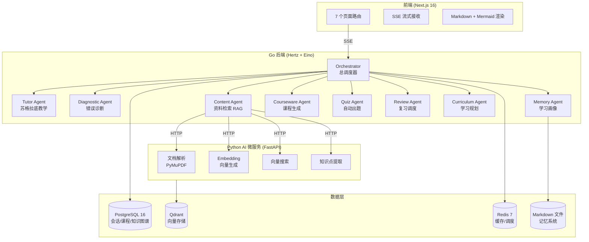
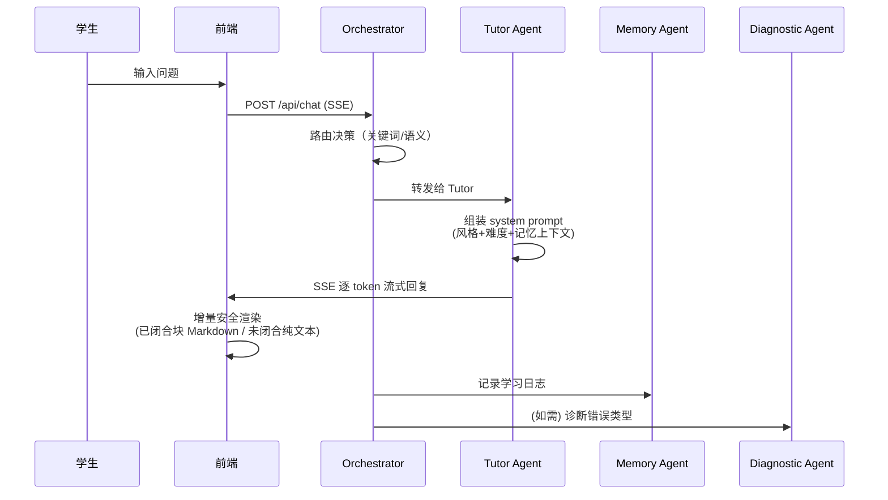
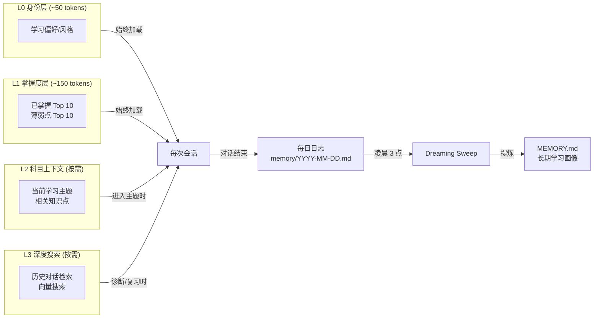
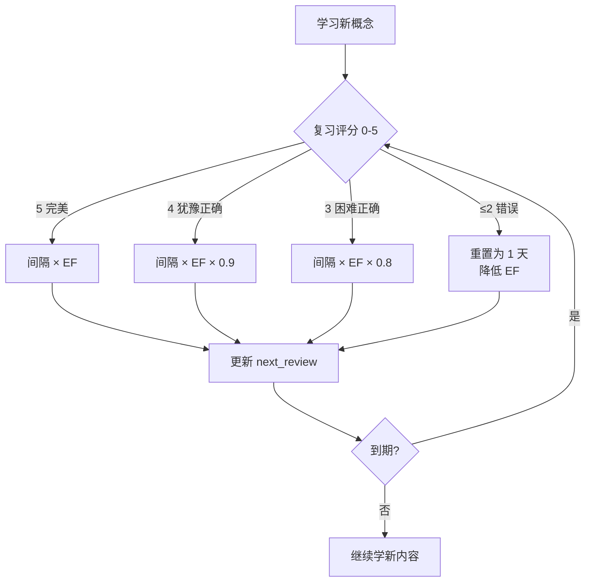
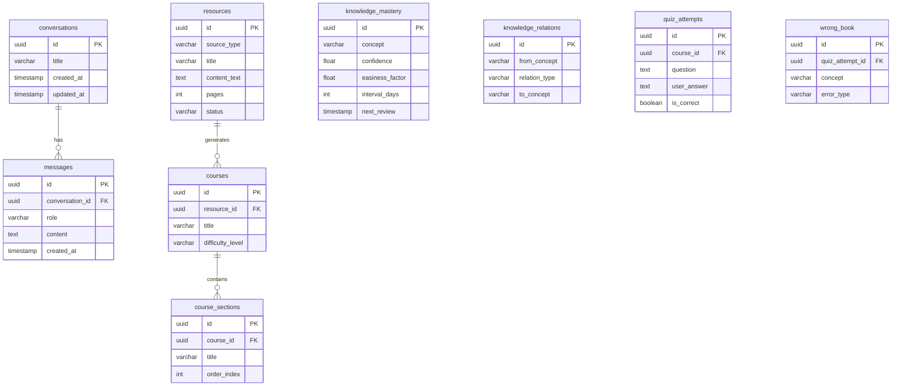

# MindFlow

> AI 驱动的苏格拉底式学习系统

MindFlow 不是问答机器人。它是一个**有记忆、会主动驱动学习节奏的 AI 私人导师**——解析你的资料、诊断你的掌握度、规划下一步、安排复习，并在多次会话中持续记忆你的学习状态。

---

## 为什么做这个

传统 AI 学习工具的问题：
- **没有记忆**：每次对话从头开始，不知道你昨天学了什么
- **直接给答案**：学生没有思考过程，知识停留在表面
- **被动等提问**：不会主动安排复习，不会告诉你该学什么

MindFlow 的解法：
- **苏格拉底式教学**：AI 绝不直接给答案，通过提问引导你自己推导
- **三层记忆系统**：跨会话记住你的掌握度、薄弱点和学习偏好
- **主动驱动**：基于遗忘曲线自动安排复习，AI 决定今天学什么

---

## 系统架构



## 对话流程



## 记忆系统



## 遗忘曲线 (SM-2)



---

## 核心能力

| 能力 | 说明 |
|------|------|
| 苏格拉底式对话 | 3 种风格（追问/讲解/比喻）× 3 档难度（初学/进阶/专家） |
| 资料理解 | PDF/TXT/URL 上传，AI 自动解析、向量化、提取知识点 |
| 知识图谱 | 自动构建知识点关系，颜色标注掌握度（绿/黄/红） |
| 遗忘曲线 | SM-2 算法自动安排间隔重复复习 |
| 三层记忆 | 即时/短期/长期，跨会话连续，Dreaming Sweep 每日提炼 |
| 章节化课程 | 资料自动转化为结构化课程，按章节学习 |
| SSE 流式输出 | 打字机效果 + 增量安全 Markdown 渲染 |

## 技术栈

| 层级 | 技术 |
|------|------|
| 前端 | TypeScript, Next.js 16, React 19, Tailwind CSS 4 |
| 后端 | Go 1.26, Eino（Agent 编排）, Hertz（HTTP/SSE）, pgx |
| AI 微服务 | Python 3.11, FastAPI, PyMuPDF, Qdrant Client |
| LLM | 硅基流动 SiliconFlow（GLM-5.1 / 可切换任意 OpenAI 兼容模型） |
| 数据库 | PostgreSQL 16（10 张表）, Qdrant（向量）, Redis 7 |
| 测试 | Go testing, Vitest, Playwright MCP |
| 部署 | Docker Compose（生产/开发分离） |

---

## 快速开始

### 前置条件

- [Docker](https://www.docker.com/) 和 Docker Compose
- 硅基流动 API Key（[获取地址](https://siliconflow.cn/)）

### 一键部署

```bash
git clone https://github.com/nothasson/MindFlow.git
cd MindFlow
cp .env.example .env
# 编辑 .env，填入 LLM_API_KEY

# 部署模式
docker-compose -f docker-compose.yml up -d

# 访问
# 前端：http://localhost:3000
# 后端：http://localhost:8080
# AI 服务：http://localhost:8000
```

### 本地开发

```bash
# 自动加载 override，挂载源码，HMR 即时生效
docker-compose up -d
```

### 常用命令

```bash
docker-compose up -d                   # 本地开发
docker-compose -f docker-compose.yml up -d  # 部署模式
docker-compose down                    # 停止
docker-compose up -d --build <服务>     # 依赖变化时重建
docker-compose logs -f backend         # 查看日志
```

---

## 项目结构

```
MindFlow/
├── backend/                          # Go 后端
│   ├── cmd/server/main.go            # 入口（路由注册 + 服务初始化）
│   ├── internal/
│   │   ├── agent/                    # 9 个 Agent
│   │   ├── handler/                  # HTTP 处理器
│   │   ├── memory/                   # 三层记忆 + Dreaming Sweep
│   │   ├── review/                   # SM-2 遗忘曲线
│   │   ├── repository/               # 数据库访问
│   │   ├── service/                  # AI 微服务客户端
│   │   └── model/                    # 数据模型
│   └── migrations/                   # 6 个数据库迁移
├── ai-service/                       # Python AI 微服务
│   ├── app/routers/                  # 7 个接口
│   ├── app/services/                 # 业务逻辑
│   └── tests/
├── frontend/                         # Next.js 前端
│   └── src/app/                      # 7 个页面
├── docs/plans/                       # 设计文档
├── docker-compose.yml                # 生产配置
├── docker-compose.override.yml       # 开发配置
└── .env.example
```

## 前端页面

| 路由 | 功能 |
|------|------|
| `/` | 主对话（SSE 流式 + Markdown/Mermaid 渲染） |
| `/resources` | 资料库（PDF/TXT/URL 上传） |
| `/knowledge` | 知识图谱可视化 |
| `/memory` | 学习记忆（画像/时间线/搜索） |
| `/dashboard` | 学习仪表盘（真实数据） |
| `/review` | 复习日历 |
| `/courses/[id]` | 课程详情 |

## 数据库设计



## 环境变量

| 变量 | 说明 | 默认值 |
|------|------|--------|
| `LLM_API_KEY` | LLM API Key | （必填） |
| `LLM_BASE_URL` | LLM API 地址 | `https://api.siliconflow.cn/v1` |
| `LLM_MODEL` | 模型名 | `Pro/zai-org/GLM-5.1` |
| `CORS_ORIGINS` | CORS 来源 | `http://localhost:3000` |

## 设计决策

| 决策 | 原因 |
|------|------|
| Go + Eino 做 Agent | 学习公司技术栈，Eino 原生支持 ChatModel + Stream |
| Python 做 AI 微服务 | AI/ML 生态最好，PDF 解析和 Embedding 不在 Go 里重造 |
| SSE 而非 WebSocket | 单向流式够用，实现更简单，兼容性更好 |
| pgx 而非 ORM | 直接 SQL，无魔法，易调试 |
| Markdown 记忆文件 | 人类可读，git 友好，借鉴 MemPalace |
| 增量安全渲染 | 避免流式 Markdown 重渲染闪烁 |
| docker-compose 分离 | 开发挂载源码 HMR，部署走镜像构建 |

## License

MIT
