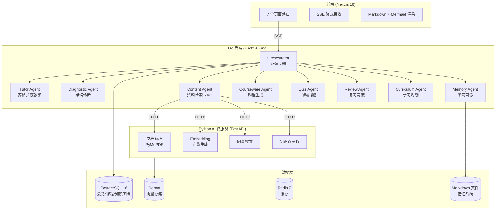
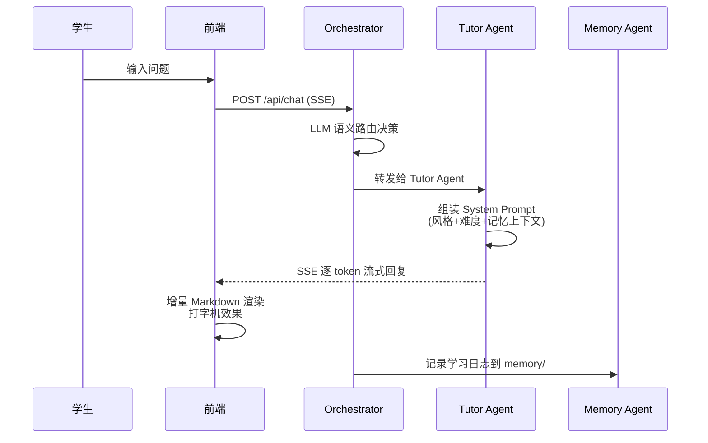
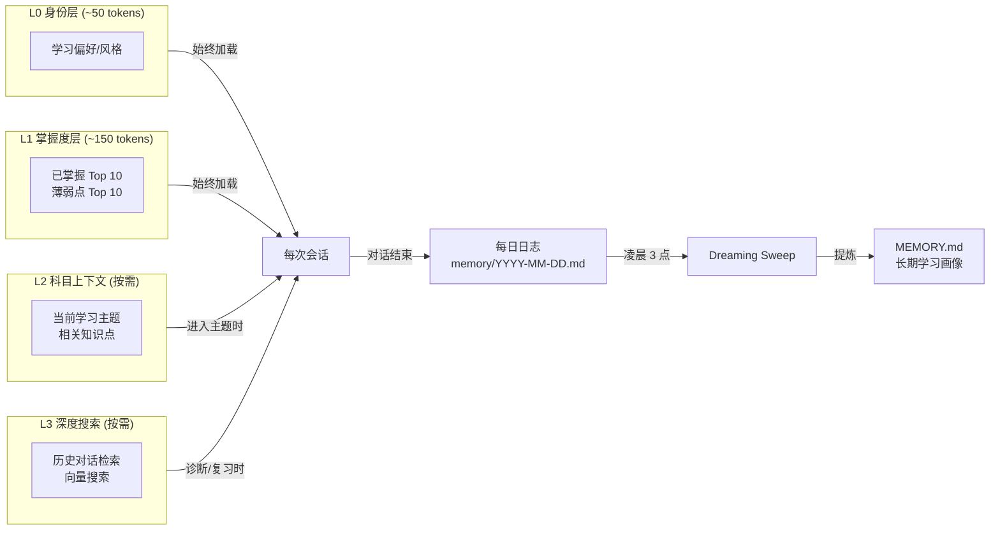
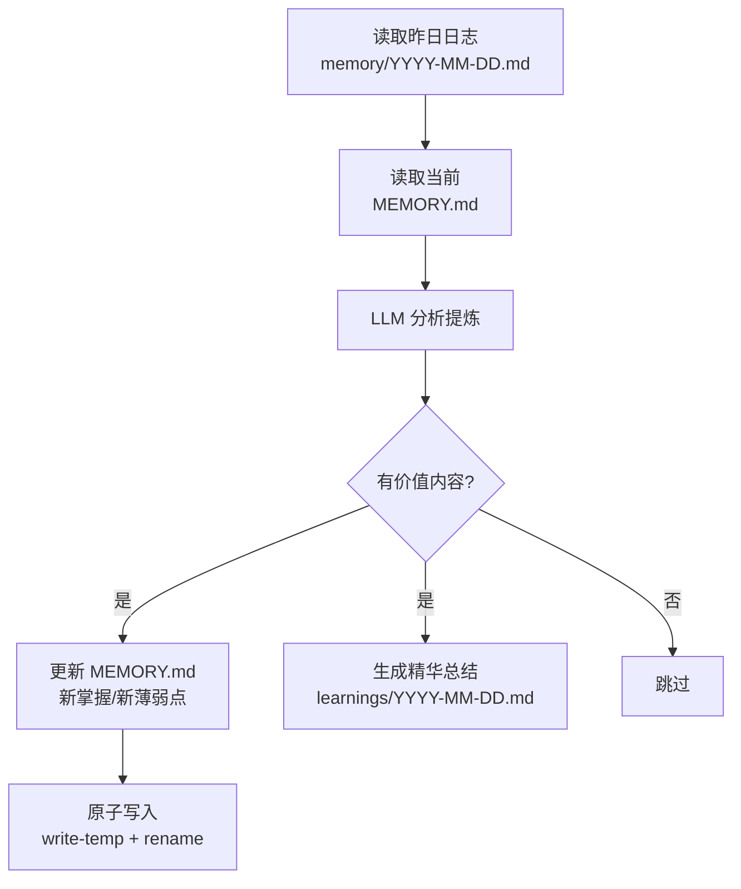
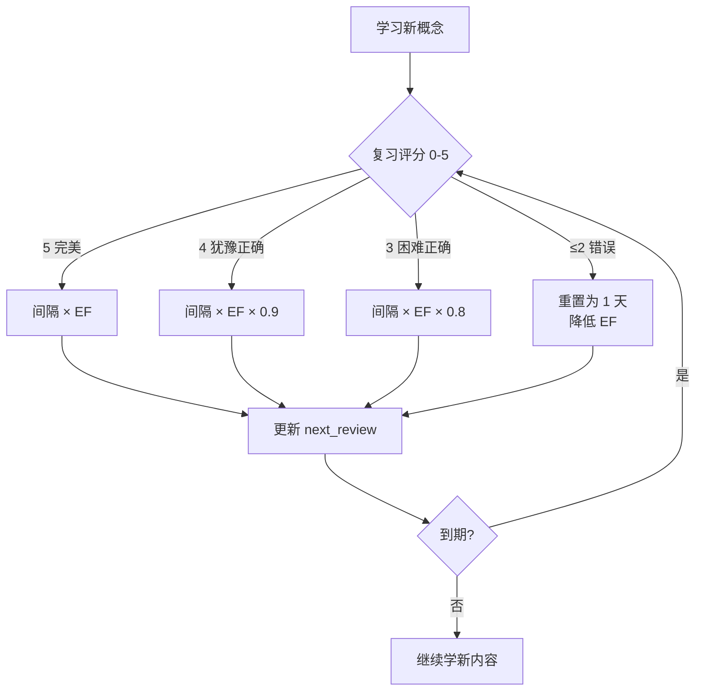
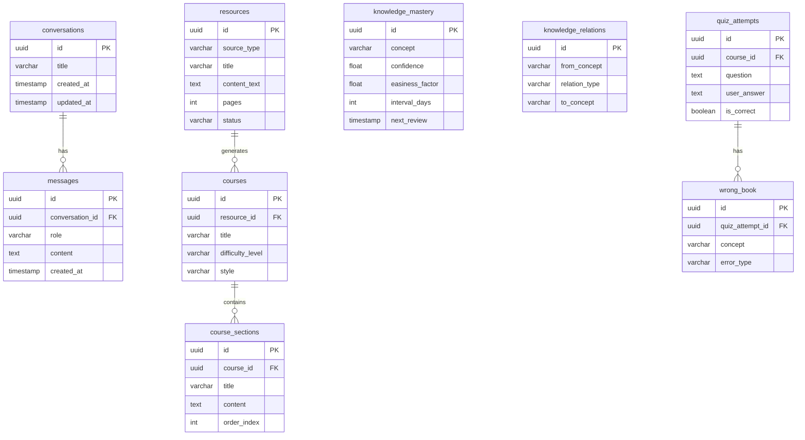

# MindFlow

> AI 驱动的苏格拉底式学习系统

MindFlow 不是问答机器人。它是一个**有记忆、会主动驱动学习节奏的 AI 私人导师**——解析你的资料、诊断你的掌握度、规划下一步、安排复习，并在多次会话中持续记忆你的学习状态。

---

## 产品定位

### 为什么做这个

传统 AI 学习工具的问题：
- **没有记忆**：每次对话从头开始，不知道你昨天学了什么
- **直接给答案**：学生没有思考过程，知识停留在表面
- **被动等提问**：不会主动安排复习，不会告诉你该学什么

MindFlow 的解法：
- **苏格拉底式教学**：AI 绝不直接给答案，通过提问引导你自己推导
- **三层记忆系统**：跨会话记住你的掌握度、薄弱点和学习偏好
- **主动驱动**：基于遗忘曲线自动安排复习，AI 决定今天学什么

### 核心设计原则

1. **AI Native** — AI 不是附加功能，是产品的核心交互方式
2. **不给答案** — 苏格拉底式引导，让学生自己推导
3. **有记忆** — 跨会话记住学生的一切学习状态
4. **AI 主动驱动** — AI 决定今天学什么、复习什么

---

## 核心能力

| 能力 | 说明 |
|------|------|
| 苏格拉底式对话 | 3 种风格（追问/讲解/比喻）× 3 档难度（初学/进阶/专家），动态组装 Prompt |
| 资料理解 | PDF/TXT/URL 上传，PyMuPDF 解析、向量化存储 Qdrant、自动提取知识点 |
| 知识图谱 | 自动构建知识点关系，前端可视化，颜色标注掌握度（绿/黄/红） |
| 遗忘曲线 | SM-2 算法自动计算复习间隔，到期自动提醒 |
| 三层记忆 | L0 身份层 + L1 掌握度层 + L2 科目上下文 + L3 深度搜索，Markdown 持久化 |
| Dreaming Sweep | 每日凌晨 3 点自动整理短期记忆，提炼到长期学习画像 |
| 章节化课程 | 资料自动转化为结构化课程，按章节学习 |
| SSE 流式输出 | 打字机效果 + 增量 Markdown/Mermaid 渲染 |

---

## 系统架构



---

## 多 Agent 系统

MindFlow 采用 Eino 框架编排多 Agent 协作，Orchestrator 作为总调度器根据语义意图路由到对应 Agent。

| Agent | 职责 | 触发条件 |
|-------|------|---------|
| **Orchestrator** | 总调度器，LLM 语义路由决策 | 每次用户消息 |
| **Tutor Agent** | 苏格拉底式教学对话，绝不直接给答案 | 默认路由，学习提问 |
| **Diagnostic Agent** | 分析学生回答，判断错误类型（概念错/方法错/粗心） | 学生给出明确答案时 |
| **Memory Agent** | 维护学生画像：掌握度、薄弱点、学习偏好 | 每次对话自动记录 |
| **Content Agent** | 基于上传资料的 RAG 检索教学 | 提到资料/文档内容时 |
| **Courseware Agent** | 将资料转化为结构化章节课程 | 生成课程时 |
| **Quiz Agent** | 基于资料和掌握度自动出题 | 要求测试时 |
| **Review Agent** | SM-2 遗忘曲线复习调度 | 复习相关 |
| **Curriculum Agent** | AI 主动规划学习内容 | 问"接下来学什么" |

### Orchestrator 路由决策

```go
// backend/internal/agent/orchestrator.go
const OrchestratorSystemPrompt = `你是 MindFlow 的教学调度器。
根据学生消息的意图，输出 JSON 格式的调度决策：
{
  "agent": "tutor",
  "reason": "学生在提问，需要苏格拉底式引导"
}

可用的 agent 类型：
- "tutor": 苏格拉底式教学对话（默认）
- "diagnostic": 诊断学生回答的错误类型
- "quiz": 出题测验
- "curriculum": 学习规划
- "content": 基于资料内容教学`
```

---

## 对话流程



---

## 记忆系统

借鉴 MemPalace 设计，采用分层记忆架构：



### 记忆文件结构

```
/data/memory/
├── MEMORY.md              # 长期记忆（核心学习画像）
├── memory/                # 每日学习日志
│   ├── 2026-04-09.md
│   └── 2026-04-08.md
└── learnings/             # 精华总结（Dreaming Sweep 产出）
    └── 2026-04-09.md
```

### Dreaming Sweep 流程

每日凌晨 3 点自动执行：



---

## 遗忘曲线 SM-2 算法



### SM-2 评分标准

| 分数 | 含义 | 间隔变化 |
|------|------|---------|
| 5 | 完美回忆 | 间隔 × EF |
| 4 | 犹豫但正确 | 间隔 × EF × 0.9 |
| 3 | 困难但正确 | 间隔 × EF × 0.8 |
| 2 | 错误但接近 | 重置为 1 天 |
| 1 | 错误且偏差大 | 重置为 1 天，降低 EF |
| 0 | 完全忘记 | 重置为 1 天，大幅降低 EF |

---

## 数据库设计



---

## 技术栈

| 层级 | 技术 |
|------|------|
| 前端 | TypeScript, Next.js 16, React 19, Tailwind CSS 4 |
| 后端 | Go 1.26, Eino（Agent 编排）, Hertz（HTTP/SSE）, pgx |
| AI 微服务 | Python 3.11, FastAPI, PyMuPDF, Qdrant Client |
| LLM | 硅基流动 SiliconFlow（GLM-5.1 / 可切换任意 OpenAI 兼容模型） |
| 数据库 | PostgreSQL 16（8 张表）, Qdrant（向量）, Redis 7 |
| 测试 | Go testing, Vitest |
| 部署 | Docker Compose（6 服务编排） |

---

## 快速开始

### 前置条件

- [Docker](https://www.docker.com/) 和 Docker Compose
- LLM API Key（[硅基流动](https://siliconflow.cn/) 或其他 OpenAI 兼容服务）

### 一键部署

```bash
git clone https://github.com/nothasson/MindFlow.git
cd MindFlow
cp .env.example .env
# 编辑 .env，填入 LLM_API_KEY

docker compose up -d

# 访问
# 前端：http://localhost:3000
# 后端：http://localhost:8080
# AI 服务：http://localhost:8000
```

### 本地开发

```bash
# 开发模式（源码挂载，HMR 热重载）
docker compose up -d

# 查看日志
docker compose logs -f backend

# 依赖变化时重建
docker compose up -d --build backend
```

### 服务清单

| 服务 | 端口 | 说明 |
|------|------|------|
| frontend | 3000 | Next.js 前端 |
| backend | 8080 | Go + Hertz + Eino |
| ai-service | 8000 | Python + FastAPI |
| postgres | 5432 | 结构化数据 |
| qdrant | 6333/6334 | 向量存储 |
| redis | 6379 | 缓存 |

---

## 项目结构

```
MindFlow/
├── backend/                          # Go 后端
│   ├── cmd/server/main.go            # 入口（路由注册 + 服务初始化 + Dreaming Sweep）
│   ├── internal/
│   │   ├── agent/                    # 9 个 Agent
│   │   │   ├── orchestrator.go       # 总调度器（LLM 语义路由）
│   │   │   ├── tutor.go              # 苏格拉底教学（3风格×3难度）
│   │   │   ├── diagnostic.go         # 错误诊断
│   │   │   ├── memory_agent.go       # 记忆管理
│   │   │   ├── content.go            # 资料 RAG
│   │   │   ├── courseware.go         # 课程生成
│   │   │   ├── quiz.go               # 自动出题
│   │   │   ├── review.go             # 复习调度
│   │   │   └── curriculum.go         # 学习规划
│   │   ├── handler/                  # HTTP 处理器
│   │   │   ├── chat.go               # POST /api/chat（SSE 流式）
│   │   │   ├── conversation.go       # 会话 CRUD
│   │   │   ├── resource.go           # 资料上传
│   │   │   ├── knowledge.go          # 知识图谱
│   │   │   ├── memory.go             # 记忆 API
│   │   │   ├── course.go             # 课程管理
│   │   │   ├── dashboard.go          # 仪表盘统计
│   │   │   └── review_handler.go     # 复习计划
│   │   ├── memory/                   # 三层记忆系统
│   │   │   ├── store.go              # 文件存储（原子写入 + 并发锁）
│   │   │   └── dreaming.go           # Dreaming Sweep
│   │   ├── review/                   # SM-2 遗忘曲线
│   │   │   └── sm2.go                # 算法实现
│   │   ├── repository/               # 数据库访问
│   │   ├── service/                  # AI 微服务客户端
│   │   ├── model/                    # 数据模型
│   │   ├── config/                   # 配置加载
│   │   └── llm/                      # LLM 客户端（Eino ChatModel）
│   └── migrations/                   # 6 个数据库迁移
├── ai-service/                       # Python AI 微服务
│   ├── app/
│   │   ├── main.py                   # FastAPI 入口
│   │   ├── routers/                  # 6 个接口
│   │   │   ├── parse.py              # POST /parse（PDF/TXT 解析）
│   │   │   ├── url.py                # POST /url（URL 内容抓取）
│   │   │   ├── embed.py              # POST /embed（向量生成）
│   │   │   ├── upsert.py             # POST /upsert（向量入库）
│   │   │   ├── search.py             # POST /search（向量检索）
│   │   │   └── extract.py            # POST /extract（知识点提取）
│   │   └── services/                 # 业务逻辑
│   └── tests/
├── frontend/                         # Next.js 前端
│   └── src/
│       ├── app/                      # 7 个页面
│       ├── components/               # UI 组件
│       ├── hooks/                    # useChat 等
│       └── lib/                      # API 客户端、类型
├── docs/plans/                       # 设计文档
├── docker-compose.yml                # Docker 编排
└── .env.example
```

---

## 前端页面路由

| 路由 | 功能 | 数据来源 |
|------|------|---------|
| `/` | 主对话（SSE 流式 + Markdown/Mermaid 渲染） | POST /api/chat |
| `/resources` | 资料库（PDF/TXT/URL 上传） | POST /api/resources/upload |
| `/knowledge` | 知识图谱可视化（颜色标注掌握度） | GET /api/knowledge/graph |
| `/memory` | 学习记忆（画像/时间线/搜索） | GET /api/memory/* |
| `/dashboard` | 学习仪表盘 | GET /api/dashboard/stats |
| `/review` | 复习日历 | GET /api/review/due |
| `/courses/[id]` | 课程详情 | GET /api/courses/:id |

---

## 环境变量

| 变量 | 说明 | 默认值 |
|------|------|--------|
| `LLM_API_KEY` | LLM API Key | （必填） |
| `LLM_BASE_URL` | LLM API 地址 | `https://api.siliconflow.cn/v1` |
| `LLM_MODEL` | 模型名 | `Pro/zai-org/GLM-5.1` |
| `POSTGRES_USER` | PostgreSQL 用户名 | `mindflow` |
| `POSTGRES_PASSWORD` | PostgreSQL 密码 | `mindflow_dev` |
| `POSTGRES_DB` | PostgreSQL 数据库名 | `mindflow` |
| `BACKEND_PORT` | 后端端口 | `8080` |
| `FRONTEND_PORT` | 前端端口 | `3000` |
| `AI_SERVICE_PORT` | AI 服务端口 | `8000` |

---

## 设计决策

| 决策 | 原因 |
|------|------|
| Go + Eino 做 Agent | 学习公司技术栈，Eino 原生支持 ChatModel + Stream |
| Python 做 AI 微服务 | AI/ML 生态最好，PDF 解析和 Embedding 不在 Go 里重造 |
| SSE 而非 WebSocket | 单向流式够用，实现更简单，兼容性更好 |
| pgx 而非 ORM | 直接 SQL，无魔法，易调试 |
| Markdown 记忆文件 | 人类可读，git 友好，借鉴 MemPalace |
| 原子写入 + 并发锁 | 防止 Memory Agent 和 Dreaming Sweep 竞态写坏文件 |
| LLM 语义路由 | 关键词规则不够灵活，让 LLM 判断用户意图更准 |
| docker-compose 分离 | 开发挂载源码 HMR，部署走镜像构建 |

---

## API 接口

### 对话

```bash
# 流式对话
curl -X POST http://localhost:8080/api/chat \
  -H "Content-Type: application/json" \
  -d '{
    "messages": [{"role": "user", "content": "什么是特征值？"}],
    "stream": true,
    "style": "socratic",
    "level": "beginner"
  }'
```

### 资料上传

```bash
# 上传 PDF
curl -X POST http://localhost:8080/api/resources/upload \
  -F "file=@lecture.pdf"

# 导入 URL
curl -X POST http://localhost:8080/api/resources/import-url \
  -H "Content-Type: application/json" \
  -d '{"url": "https://example.com/article"}'
```

---

## 开发规范

详见 [CODEBUDDY.md](./CODEBUDDY.md)

核心规则：
1. **提交前必须验证**：`go build`、`go test`、`npm run build`、`npm run lint` 全部通过
2. **全链路检查**：改一个功能必须顺着整条链路检查前后端同步
3. **不展示虚假数据**：没有真实数据时展示空态，不编造假数据

---

## License

MIT
